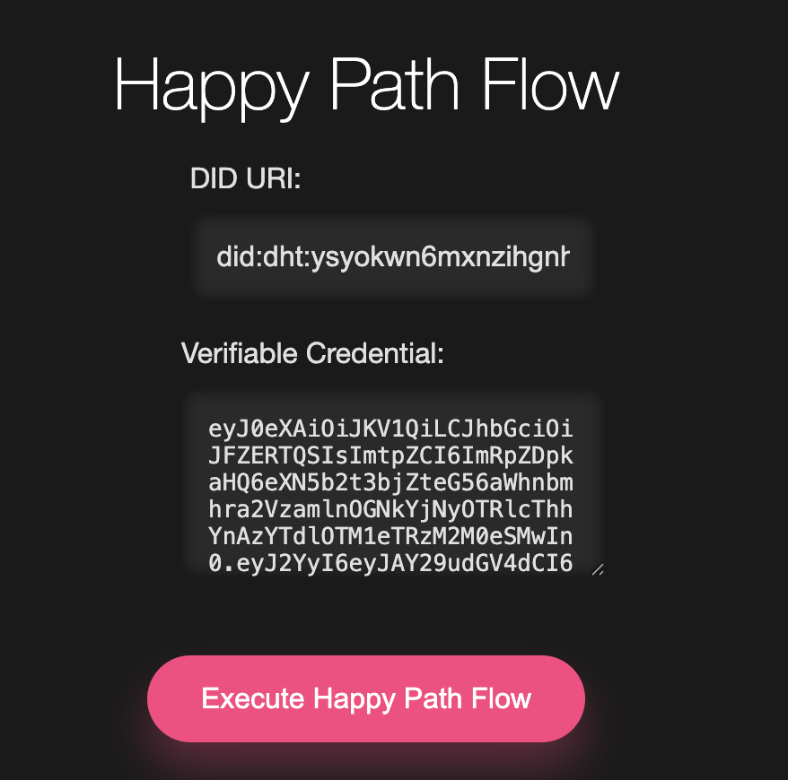

# WASM Exemplar

A complete implementation demonstrating the TBDex protocol flow using our TypeScript npm package.

## Overview

This project showcases a full TBDex flow implementation using our TBDex WASM sdk. It demonstrates the interaction between a client and a PFI endpoint using the TBDex protocol.

## Prerequisites

- Node.js (v14 or higher)
- npm (v6 or higher)
- Git

## Dependencies

- TBDex TypeScript package
- A running PFI endpoint

## Getting Started

### Setting up the PFI Endpoint

1. Clone the PFI example repository:
```bash
git clone https://github.com/TBD54566975/tbdex-rs.git
cd tbdex-rs/examples/hosted-wallet-ts
```

2. Install dependencies and start the PFI server:
```bash
npm install
npm run start:pfi
```

### Running the WASM Exemplar

1. Clone this repository:
```bash
git clone https://github.com/TBD54566975/tbd-examples.git
cd  javascript/tbdex-wasm-exemplar/
```

2. Install dependencies:
```bash
npm install
```

3. Start the development server:
```bash
npm run dev
```

## Usage

The application comes pre-configured with default Verifiable Credentials (VC) and Decentralized Identifier (DID) for testing purposes.

### Quick Start
1. Navigate to the application in your browser
2. Click the "Execute Happy Path Flow" button to initiate a complete TBDex flow

### Flow Visualization


## Architecture

This project demonstrates:
- WASM integration with TBDex
- Protocol message flow
- PFI endpoint interaction
- VC and DID handling